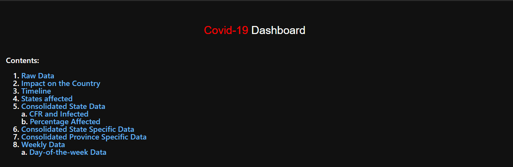
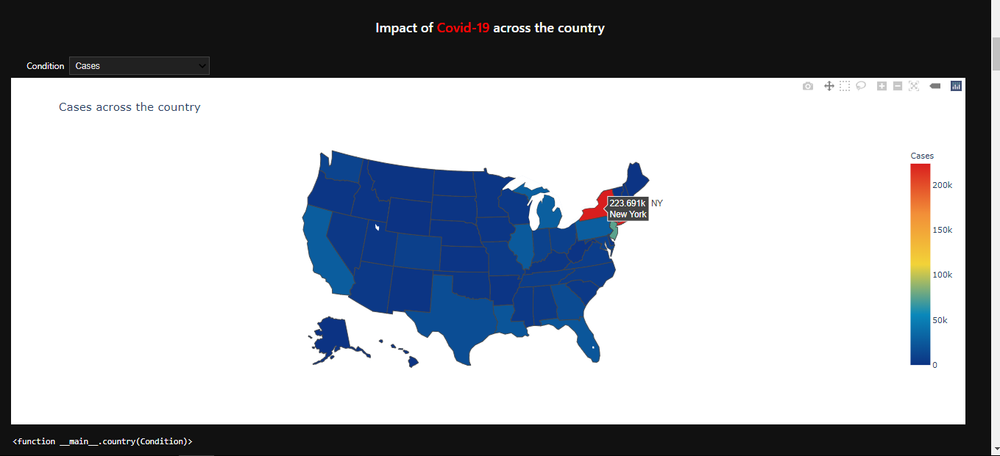
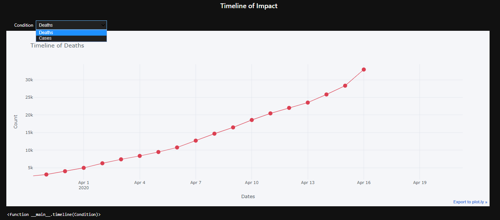
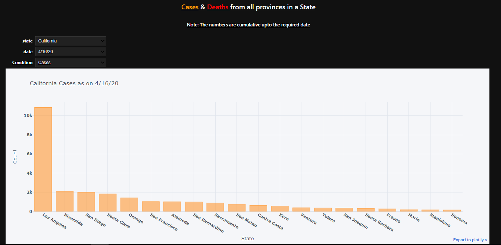

# Covid-19 Dashboard   

Covid-19 EDA and Dashboard(using voila) for US States and cities.  

EDA of the impact of novel Corona virus on the United States and a dashboard for the same. 
Install requirements.txt for all packages.
### For dashboarding: 
      Install : pip install voila  
      Run (cmd) : voila \path\to\notebook\notebook.ipynb --theme=dark  

### Note: 
      For Cell Execution timeout Error, add    --ExecutePreprocessor.timeout=600

### Source: 
      https://github.com/CSSEGISandData/COVID-19  
      https://worldpopulationreview.com/states/  

Screenchots:  

